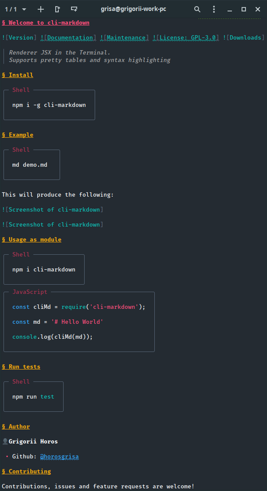

Welcome to cli-markdown
===


[](https://github.com/grigorii-horos/cli-markdown#readme)
[](https://github.com/grigorii-horos/cli-markdown/graphs/commit-activity)
[](https://github.com/grigorii-horos/cli-markdown/blob/master/LICENSE)


> Renderer Markdown in the Terminal.  
> Supports pretty tables and syntax highlighting

## Install

```sh
npm i -g cli-markdown
```

## Example

```sh
md demo.md
```

This will produce the following:



<!--  -->

## Usage as module

```sh
npm i cli-markdown
```

```js
const cliMd = require('cli-markdown');

const md = '# Hello World'

console.log(cliMd(md));
```

## Run tests

```sh
npm run test
```

## Author

👤**Grigorii Horos**

* Github: [@horosgrisa](https://github.com/horosgrisa)

## Contributing

Contributions, issues and feature requests are welcome!

Feel free to check [issues page](https://github.com/horosgrisa/cli-markdown/issues).

## Show your support

Give a ⭐️ if this project helped you!

## License

Copyright © 2019 [Grigorii Horos](https://github.com/horosgrisa).

This project is [GPL-3.0-or-later](https://github.com/horosgrisa/cli-markdown/blob/master/LICENSE) licensed.
